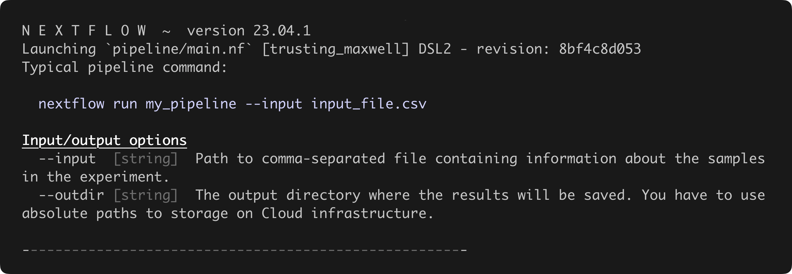
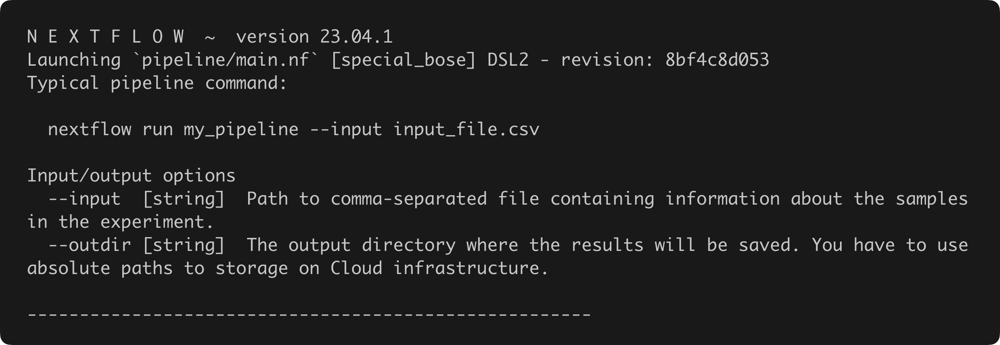

## `paramsHelp()`

This function returns a help message with the command to run a pipeline and the available parameters.
Pass it to `log.info` to print in the terminal.

It accepts two arguments:

1. An example command, typically used to run the pipeline, to be included in the help string
2. The file name of a Nextflow Schema file (Default: `nextflow_schema.json`)

!!! Note

    `paramsHelp()` doesn't stop pipeline execution after running.
    You must add this into your pipeline code if it's the desired functionality.

Typical usage:

=== "main.nf"

    ```groovy
    --8<-- "examples/paramsHelp/pipeline/main.nf"
    ```

=== "nextflow.config"

    ```groovy
    --8<-- "examples/paramsHelp/pipeline/nextflow.config"
    ```

=== "nextflow_schema.json"

    ```json
    --8<-- "examples/paramsHelp/pipeline/nextflow_schema.json"
    ```

Output:

```
--8<-- "examples/paramsHelp/log.txt"
```

!!! warning

    We shouldn't be using `exit` as it kills the Nextflow head job in a way that is difficult to handle by systems that may be running it externally, but at the time of writing there is no good alternative.
    See [`nextflow-io/nextflow#3984`](https://github.com/nextflow-io/nextflow/issues/3984).

## Specific parameter help

By default, when printing the help message only a selection of attributes are printed: type of the variable, accepted options (enums), description and default value.

To print the complete information for a single parameter, pass the parameter name to the `--help` option.

For example, with the example above:

```bash
nextflow run my_pipeline --help outdir
```

```
--8<-- "examples/paramsHelp/log_outdir.txt"
```

## Hidden parameters

Params that are set as `hidden` in the JSON Schema are not shown in the help message.
To show these parameters, set the `validationShowHiddenParams` parameter:

```bash
nextflow run my_pipeline --help --validationShowHiddenParams
```

or specifying it in the configuration file

```groovy
params.validationShowHiddenParams = true
```

## Coloured logs

By default, the help output is coloured using ANSI escape codes.

If you prefer, you can disable these by using the argument monochrome_logs, e.g. `paramsHelp(monochrome_logs: true)`. Alternatively this can be set at a global level via parameter `--monochrome_logs` or adding `params.monochrome_logs = true` to a configuration file.

=== "Default (coloured)"

    

=== "Monochrome logs"

    
